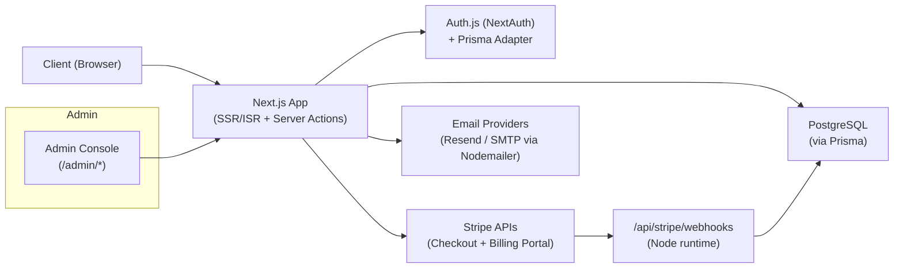
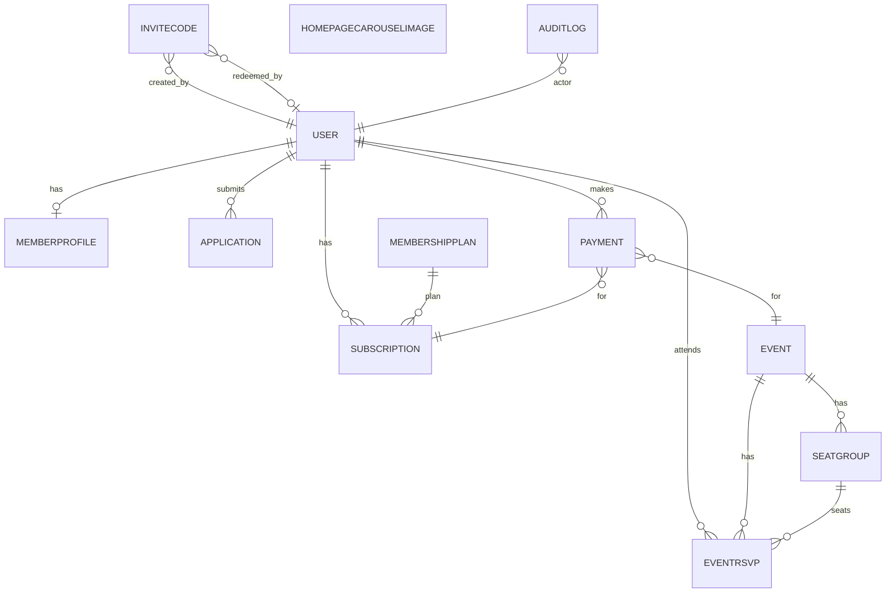

# HENRYS – Architecture & Design

**Status:** Draft 0.1  
**Date:** November 10, 2025  
**Owners:** Core engineering (HENRY’S)  
**Scope:** Web app (Next.js) including auth, membership, events/tickets, admin, email, and payments.

---

## Table of Contents

- [Executive Summary](#executive-summary)
- [Problem & Context](#problem--context)
- [Goals / Non-Goals](#goals--non-goals)
- [Stakeholders & Users](#stakeholders--users)
- [System Context Diagram](#system-context-diagram)
- [Architecture Overview](#architecture-overview)
  - [Components](#components)
  - [Data Flow](#data-flow)
- [Data Model](#data-model)
  - [Entities](#entities)
  - [ERD (Mermaid)](#erd-mermaid)
  - [Indexes & Integrity](#indexes--integrity)
- [API Surface](#api-surface)
- [Runtime & Environments](#runtime--environments)
- [Build & Deployment](#build--deployment)
- [Observability](#observability)
- [Security & Privacy](#security--privacy)
- [Performance & Scale](#performance--scale)
- [Dependencies](#dependencies)
- [Environment Variables](#environment-variables)
- [Risks & Open Questions](#risks--open-questions)
- [Roadmap & Milestones](#roadmap--milestones)
- [Glossary](#glossary)
- [Provenance](#provenance)

---

## Executive Summary

HENRYS is a mobile‑first, invite‑only IRL dating/members club. The app supports:
- **Applications → Invitations → Onboarding**
- **Membership subscriptions** (Stripe Checkout, Billing Portal, webhooks)
- **Event discovery, RSVP, tickets, and seating/matching**
- **Admin console** for reviews, events, and content
- **Transactional email** (magic links, confirmations, receipts)

**Stack:** Next.js (App Router, TypeScript), Auth.js (NextAuth) with email links + credentials, Prisma (PostgreSQL), Stripe, Resend/SMTP, Tailwind, pnpm, Vitest.

---

## Problem & Context

We need a cohesive system for managing a private community: a premium application funnel, paid memberships, curated events, and light operational tooling for admins/hosts—delivered as a modern web app with low operational overhead and clear security posture.

---

## Goals / Non-Goals

**Goals**
- Smooth **application → invitation → sign‑in** flow
- Durable **membership** management (Stripe) with accurate webhooks/receipts
- **Event** lifecycle (create → publish → RSVP/tickets → seating → host sheet)
- Clear **admin** workflows with guardrails and auditability
- Lean **ops**: sensible defaults for deploy, secrets, and monitoring

**Non‑Goals (for now)**
- Native mobile apps
- Complex social graph/messaging
- Advanced host tooling beyond seating/host sheets
- On‑prem/self‑hosted email or payments

---

## Stakeholders & Users

- **Applicants** – apply and await invitation
- **Members** – access dashboard, events, tickets, billing
- **Hosts** – potential host views/tools (scaffolded)
- **Admins** – application triage, events, seating, homepage content, email previews

---

## System Context Diagram

> Mermaid source (for GitHub preview):

---

## Architecture Overview

### Components

- **Next.js App (App Router)** — SSR/ISR, server and client components, server actions for admin mutations; API routes for Stripe and checkout.
- **Auth** — Auth.js (NextAuth) with **email magic links** (Resend) and **credentials** (bcryptjs). JWT sessions; Prisma adapter persists sessions/accounts.
- **Data** — Prisma ORM targeting **PostgreSQL** (production). A **Prisma client stub** is present for dev/preview; ensure it’s never bundled in prod.
- **Payments** — Stripe Checkout + Billing Portal. Webhooks synchronize `Subscription` and `Payment` tables; receipts emailed.
- **Email** — Resend (primary) or SMTP; MJML templates with safe fallback renderer.
- **Admin Console** — Applications, events, RSVPs, seating planner (seat groups/tables), homepage carousel, email previews.
- **Frontend UI** — Tailwind + local UI primitives; MDX for static pages.

### Data Flow

1. **Application** submitted at `/apply` → stored → confirmation email → admin triage → invite code issuance.
2. **Invitation & Sign-in** via magic link or password → JWT session (Auth.js) → role‑gated routes via `middleware.ts`.
3. **Membership**: member selects plan → Stripe Checkout → webhook updates `Subscription` + `Payment` → receipt email → Billing Portal for management.
4. **Events**: list/detail → member RSVP/ticket purchase → Checkout → webhook → RSVP state + optional seat group assignment → host sheet export.

---

## Data Model

### Entities

- **User** — core identity; `role` ∈ {GUEST, APPLICANT, MEMBER, HOST, ADMIN}
- **MemberProfile** — 1:1 with User; demographic/profile fields, preferences
- **Application** — structured responses + status; reviewer notes; invite linkage
- **InviteCode** — code lifecycle; createdBy, redeemedBy
- **MembershipPlan** — plan metadata with `stripePriceId`
- **Subscription** — user ↔ plan ↔ Stripe customer; status and periods
- **Event** — schedule, venue, capacity, pricing, visibility
- **EventRsvp** — RSVP state, seating flags, attendance
- **SeatGroup** — tables/groups for seating plan
- **Payment** — normalized from Stripe payment intents (receipt URL, amount)
- **HomepageCarouselImage** — content admin
- **AuditLog** — actor/target, action, diff JSON
- **Auth tables** — Session, Account, VerificationToken (Auth.js)

### ERD (Mermaid)

### Indexes & Integrity

- `EventRsvp(eventId, status)` — fast listing/filtering for admin + host flows
- `Subscription(userId, planId)` and `Subscription(stripeCustomerId)`
- `Payment(userId, eventId)` and `Payment(stripePaymentIntentId)` (unique)
- `InviteCode(code)` (unique) with `redeemedAt` guard
- Enforce cascades: deleting an **Event** should restrict if RSVPs exist

---

## API Surface

**Public pages**  
`/` · `/about` · `/faq` · `/legal/terms` · `/apply` · `/login` · `/register` · `/reset-password`

**Member**  
`/dashboard` · `/events` · `/events/[eventId]`

**Admin**  
`/admin` · `/admin/applications` · `/admin/events`  
`/admin/events/[eventId]/rsvps` · `/admin/events/[eventId]/match`  
`/admin/events/[eventId]/match/export` (GET: host sheet)  
`/admin/events/[eventId]/match/host-sheet` (GET)  
`/admin/homepage-carousel` · `/admin/email-previews`

**API routes (App Router)**  
- `GET|POST /api/auth/[...nextauth]` — Auth.js handlers  
- `POST /api/stripe/webhooks` — Stripe webhook (Node runtime)  
- `POST /api/stripe/create-membership-session` — start Checkout  
- `POST /api/stripe/billing-portal` — Billing Portal session  
- `POST /api/events/[eventId]/checkout` — ticket Checkout

**Auth & RBAC**  
- `middleware.ts` gates `/dashboard`, `/events`, `/host`, `/admin` by role  
- Sessions via JWT; consider short TTL + rotation

---

## Runtime & Environments

- **Hosting**: Next.js (likely Vercel); Stripe routes pinned to **Node runtime** (not Edge)
- **Envs**: `.env`/`.env.development`; **strip secrets from repo**
- **Database**: PostgreSQL (managed); Prisma migrations in `prisma/`
- **Assets**: Remote images only (Unsplash/placehold) configured in Next image domains
- **Rate limiting**: currently in‑memory (per instance) — see Security/Performance sections

---

## Build & Deployment

- **Package manager**: pnpm  
- **Lint/format**: ESLint, Prettier, Husky pre‑commit  
- **Tests**: Vitest for webhook logic; Playwright + axe installed (e2e scaffolding)  
- **CI (recommended)**: typecheck, lint, unit tests, minimal e2e smoke, build.  
- **CD**: target automatic deploys on main with env‑gated webhooks and migrations

---

## Observability

**Now**
- Console logs and Stripe dashboard visibility
- No central error tracking

**Recommendations**
- Add **Sentry** (or equivalent) for Next.js and API routes
- Add **structured logging** on webhook events (type, idempotency key, upsert results)
- Minimal **OTel traces** for `/api/stripe/webhooks` and checkout endpoints
- **Alerts** on repeated webhook failures (to avoid silent retry storms)

---

## Security & Privacy

**Current posture**
- Auth.js with Prisma adapter; **bcryptjs** for password hashing
- Stripe webhook signature verification
- Role‑based route gating via middleware
- Invite code salting; MJML email templating with safe fallback

**Gaps & Actions**
1. **Rate limiting**: move from in‑memory to a **shared store** (e.g., Upstash Redis) for multi‑instance/serverless.
2. **Session hardening**: shorter JWT TTL + rotation; invalidate on role change or password reset.
3. **CSP & security headers**: add explicit policy (unless provided by host) and disable inline script risks.
4. **PII handling**: classify fields in `MemberProfile`/`Application`, minimize data returned to admin lists; add **read‑audit** entries.
5. **Prisma stub guard**: build‑time checks to prevent shipping the dev stub to production.
6. **Secrets management**: audit env var usage; require non‑empty keys on boot in prod.

---

## Performance & Scale

- Home page currently forces SSR (`revalidate = 0`); monitor read load; consider caching where safe
- Webhook handlers must remain **idempotent** (continue using upserts and event‑id guards)
- Ensure indices listed above; verify query plans for RSVP admin pages
- Use **CDN/remote images** for media; avoid serving large assets from the app

---

## Dependencies

Core highlights (see lockfile for versions):
- `next`, `react`, `typescript`
- `next-auth`, `@auth/prisma-adapter`
- `prisma`, `@prisma/client`
- `stripe`, `@stripe/stripe-js`
- `zod`, `react-hook-form`
- `tailwindcss`, `lucide-react`
- `bcryptjs`, `nodemailer`, `resend`
- `vitest`, `@testing-library/*`, `playwright`, `axe-playwright`

---

## Environment Variables

**Auth**  
`AUTH_SECRET`, `NEXTAUTH_SECRET`, `AUTH_URL` / `NEXTAUTH_URL`

**Database**  
`DATABASE_URL` (Postgres), `POSTGRES_PRISMA_URL` (if used)

**Stripe**  
`STRIPE_SECRET_KEY`, `NEXT_PUBLIC_STRIPE_PUBLISHABLE_KEY`,  
`STRIPE_WEBHOOK_SECRET`, `STRIPE_FOUNDING_MONTHLY_PRICE_ID`, `STRIPE_FOUNDING_ANNUAL_PRICE_ID`

**Email**  
`AUTH_RESEND_KEY` / `RESEND_API_KEY`, `AUTH_EMAIL_FROM`, and optional SMTP vars

**Site**  
`SITE_URL`, `NEXT_PUBLIC_SITE_URL`

**Misc**  
`INVITE_CODE_SALT`, `RATE_LIMIT_MAX_REQUESTS`, `RATE_LIMIT_WINDOW_SECONDS`, `USE_MJML`

> Store secrets **outside the repo**. Validate required keys at boot in production.

---

## Risks & Open Questions

**Key Risks**
- In‑memory rate limit isn’t effective across serverless/multi‑instance deployments
- Potential for dev **Prisma stub** to leak into prod; add build guard
- Webhook error handling can trigger retries; needs alerting + backoff strategy
- Role enums exist in code and schema; ensure they stay synchronized

**Open Questions**
- Final **Postgres** provider (Vercel, RDS, Neon, etc.) and connection pooling
- **Rate‑limit backend** choice (Upstash Redis or equivalent) and per‑route policy
- Long‑term **auth path**: magic‑link only vs. password support
- **Seating planner** heuristics beyond age buckets (interests, balance cues)
- Host tooling scope and timeline

---

## Roadmap & Milestones

**P0 – Ship‑ready hardening**
- Shared‑store rate limiting
- Build‑time guard for Prisma client stub
- Sentry + minimal OTel traces
- CI pipeline: typecheck, lint, tests, e2e smoke

**P1 – Admin & member polish**
- Expand webhook tests (idempotency & error branches)
- “Resend receipt” / “Refund note” affordances (UI links to Stripe)
- Application triage quality-of-life (filters/saved views)

**P2 – Privacy & compliance**
- Data retention policy for Applications/AuditLog
- Read‑audit for PII access on admin routes

---

## Glossary

- **App Router** — Next.js routing + server components paradigm  
- **Server Action** — Next.js server function invoked from UI for mutations  
- **RBAC** — Role‑based access control  
- **PII** — Personally Identifiable Information  
- **ISR** — Incremental Static Regeneration

---

## Provenance

This design reflects the structure and code observed in the uploaded repository snapshot, plus standard best‑practice recommendations for Next.js, Auth.js, Stripe, and Prisma deployments.
